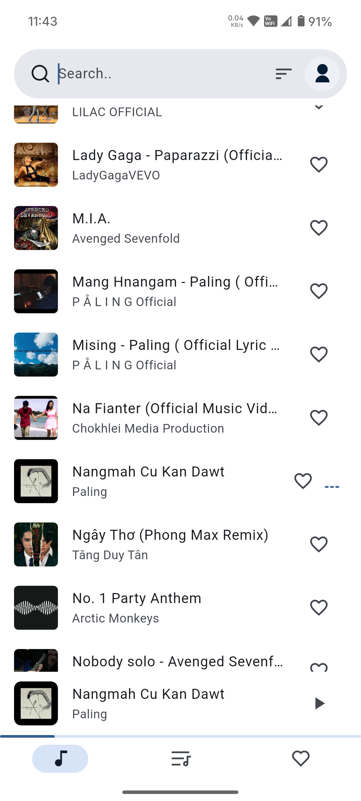
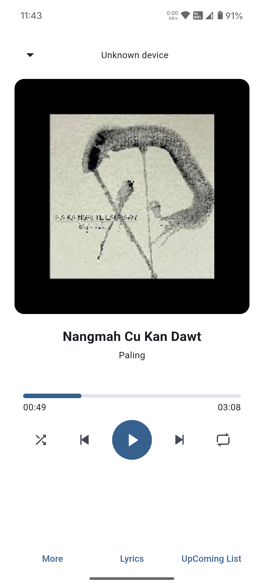
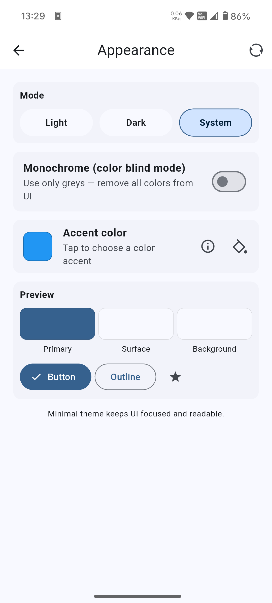
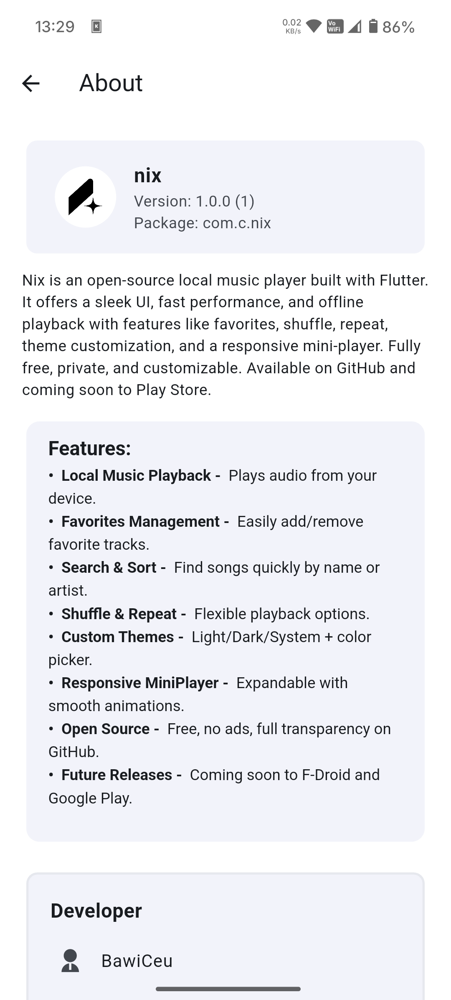

# Nix — Local Music Player

[](LICENSE)

Nix is a fast, Material 3 music player built with Flutter.  
It focuses on smooth animations, a clean UI, high performance, and offline local playback.

---

## ✨ Features
- 🎵 Play local audio files (MP3, AAC, FLAC, OGG, WAV)
- 📂 Library by Songs, Playlists, Favorites
- 🔁 Queue controls (next, prev, repeat, shuffle, seek)
- 📱 Background playback with system media controls
- 🖼️ Dynamic light/dark theming
- 🌐 Works on Android (iOS, Windows, macOS, Linux support TBD)

---

## 🌍 Supported Languages
- 🇬🇧 English (Default)  
- 🇲🇲 Burmese  
- 🇲🇲 Hakha  
- 🇲🇲 Falam  

---

## 📸 Screenshots

| Songs List Page | Now Playing Page | Appearance Page | About Page |
|---------|-------------|-------|-----------|
|  |  |  |  |

---

## 🚀 Getting Started

```bash
┌──(user㉿kali)-[~]
└─$ git clone https://github.com/BawiCeu16/nix.git

┌──(user㉿kali)-[~]
└─$ cd nix

┌──(user㉿kali)-[~/nix]
└─$ flutter pub get

┌──(user㉿kali)-[~/nix]
└─$ flutter run
